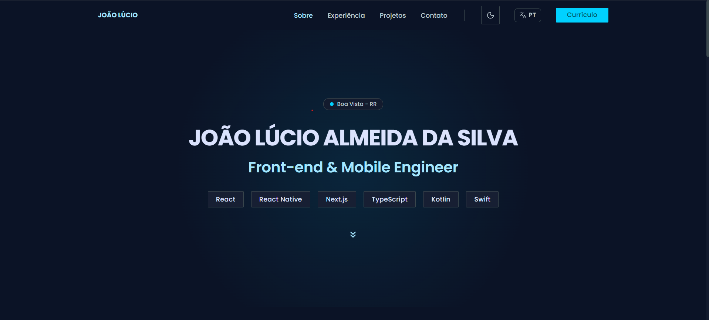
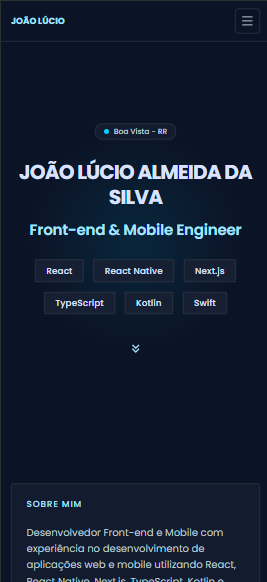

# Portfólio — João Lúcio Almeida

Portfólio pessoal desenvolvido com Vue 3, TypeScript e Vite. O site apresenta experiências, projetos, contatos e links para download do currículo em português e inglês.

## Prévia

### Desktop



### Mobile



## Funcionalidades

- Interface responsiva para desktop e dispositivos móveis.
- Temas claro e escuro com alternância persistida no navegador.
- Internacionalização em português e inglês.
- Navegação por seções com destaque do item ativo.
- Links para GitHub, LinkedIn, WhatsApp, e-mail e lojas de aplicativos.
- Download do currículo em PDF conforme o idioma selecionado.
- Animações e interações acessíveis, incluindo suporte a `prefers-reduced-motion`.

## Tecnologias

- [Vue 3](https://vuejs.org/)
- [TypeScript](https://www.typescriptlang.org/)
- [Vite](https://vite.dev/)
- [Tailwind CSS](https://tailwindcss.com/)
- [Lucide](https://lucide.dev/) e SVGs próprios para ícones
- Fonte [Poppins](https://fonts.google.com/specimen/Poppins)

## Requisitos

- Node.js 20 ou superior
- npm, Yarn ou outro gerenciador compatível

## Como executar

Clone o repositório e instale as dependências:

```bash
git clone <url-do-repositorio>
cd joao-lucio-portfolio
yarn install
```

Inicie o servidor de desenvolvimento:

```bash
yarn dev
```

Para criar e visualizar a versão de produção:

```bash
yarn build
yarn preview
```

Os comandos equivalentes com npm são `npm install`, `npm run dev`, `npm run build` e `npm run preview`.

## Estrutura principal

```text
src/
├── assets/             # Ícones e assets dos temas claro/escuro
├── components/         # Componentes reutilizáveis da interface
├── composables/        # Lógica compartilhada (tema, idioma e scroll spy)
├── constants/          # Links e dados de contato do perfil
├── i18n/               # Traduções pt-BR/en
├── utils/              # Utilitários, como máscara de telefone
├── App.vue             # Composição principal da página
└── style.css           # Tokens e estilos globais

public/
├── file/               # Currículos em PDF
├── img/                # Imagens de prévia do projeto
└── favicon.svg         # Favicon
```

## Currículos

Os arquivos ficam em `public/file/` e são disponibilizados pelo botão de currículo:

- `resume-ptBr.pdf`
- `resume-en.pdf`

Para atualizar os documentos, substitua os arquivos mantendo esses nomes ou ajuste o composable em `src/components/ResumeButton/useResumeButton.ts`.

## Personalização

Links, telefone, cidade e e-mail ficam centralizados em `src/constants/profile.ts`. As traduções ficam em `src/i18n/translations.ts`, permitindo alterar o conteúdo sem espalhar textos pelo componente principal.

## Licença

Este projeto é um portfólio pessoal. Consulte o autor antes de reutilizar conteúdo, imagens ou informações de contato.
